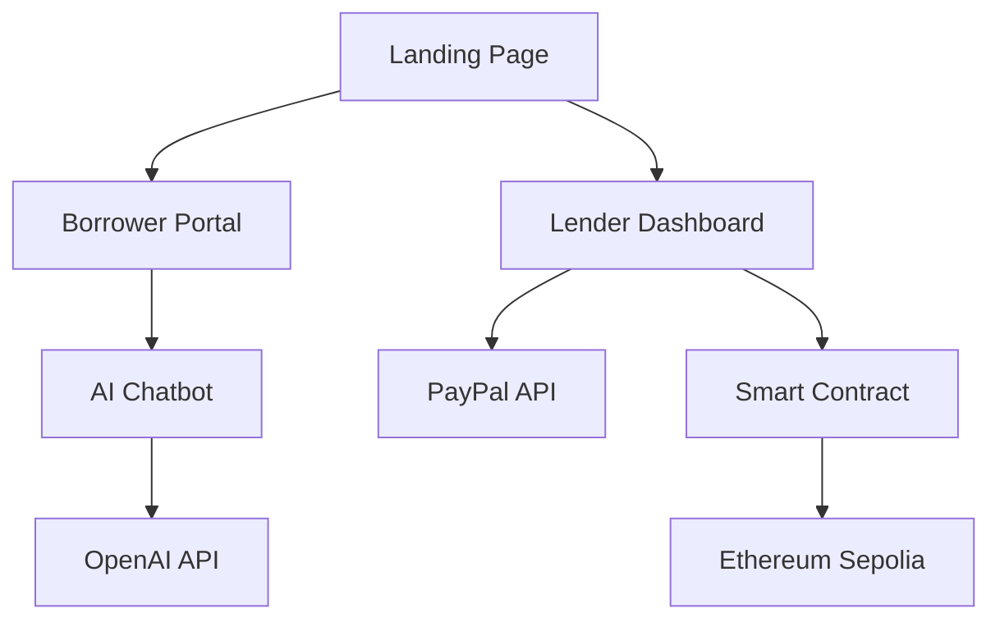
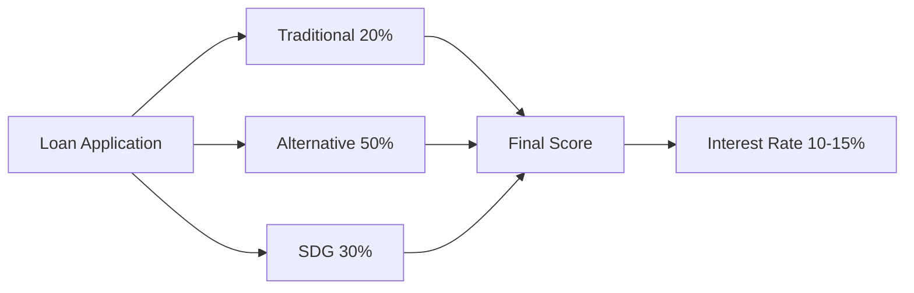

# 🌱 GreenLend: AI-Powered Sustainable Microfinance Platform

[](https://greenlend.elpeef.com/)
[](LICENSE)
[](https://nextjs.org/)
[](https://www.typescriptlang.org/)
[](https://soliditylang.org/)

> For security and IP protection, the full production code is currently hosted privately. This repository demonstrates the project structure and documentation.

GreenLend is an AI-driven microfinance platform that unlocks finance for underserved communities by evaluating sustainability impact alongside traditional creditworthiness. Built for the unbanked, powered by AI agents, and secured by blockchain.

---

## 🎯 The Problem

- **70% of MSME loan applications are rejected** due to insufficient credit history
- **1.4 billion people globally are unbanked** and excluded from traditional finance
- **Indonesia's MSME financing gap: $8.9 billion annually**
- **Sustainable businesses struggle to access capital** despite positive environmental impact

## 💡 Our Solution

GreenLend uses **AI-powered conversational interfaces** and **SDG-based credit scoring** to provide microloans to entrepreneurs who create positive environmental and social impact—even without traditional credit history.

### Key Innovation: **Multi-Factor Scoring Algorithm**

```
Final Credit Score = (Traditional × 20%) + (Alternative Data × 50%) + (SDG Impact × 30%)
```

**Result**: A mushroom farmer with zero credit history but high SDG alignment can access capital. A solar panel installer gets better interest rates for clean energy contributions.

---

## ✨ Features

### 🤖 For Borrowers (The Unbanked)
- **Conversational AI Application** - Apply through natural language chat in English or Bahasa Indonesia
- **No Credit History Required** - Alternative data scoring evaluates business viability and impact
- **Instant Assessment** - Real-time evaluation of 15+ factors including SDG contributions
- **Low-Literacy Friendly** - No complex forms, just conversation

### 💼 For Lenders (Impact Investors)
- **SDG-Aligned Portfolio Dashboard** - Track financial returns AND environmental impact
- **Transparent Risk Assessment** - Every loan includes credit score (0-100), SDG score (0-100), and risk level
- **Dual Disbursement Options**:
  - 💳 **PayPal** - Instant traditional disbursement
  - ⛓️ **Blockchain (Ethereum)** - Transparent, immutable on-chain records
- **Real-Time Portfolio Analytics** - CO₂ reduced, jobs created, women empowered
- **Transaction History** - Full audit trail with Etherscan verification

### 📊 Platform Intelligence
- **AI-Powered Scoring Engine** - Multi-factor analysis combining traditional and alternative data
- **SDG Mapping** - Automatic alignment with UN Sustainable Development Goals
- **Dynamic Interest Rates** - 10-15% based on credit score with SDG discounts up to 3%
- **Explainable AI** - Full transparency into decision-making process

---

## 🛠️ Tech Stack

### Frontend
- **Next.js 15.3.8** - React framework with server-side rendering
- **React 19** - UI component library
- **TypeScript** - Type-safe development
- **Tailwind CSS** - Utility-first styling
- **shadcn/ui** - Accessible component system

### AI & APIs
- **OpenAI GPT-4** - Conversational loan application engine
- **PayPal API** - Traditional payment processing

### Blockchain
- **Solidity 0.8.19** - Smart contract language
- **Ethers.js v6** - Ethereum interaction library
- **RainbowKit** - Wallet connection UI
- **Ethereum Sepolia Testnet** - Development blockchain
- **MetaMask, Coinbase Wallet, WalletConnect** - Multi-wallet support

### Smart Contract
- **GreenLend.sol** - Deployed at `0x74E635BF12B540E50d7A23043503F8D548Ac5188`
- **Functions**: `disburseLoan()`, `repayLoan()`, `getLoan()`, `getStats()`
- **Events**: `LoanDisbursed`, `LoanRepaid`
- [View on Etherscan](https://sepolia.etherscan.io/address/0x74E635BF12B540E50d7A23043503F8D548Ac5188)

---

## 🚀 Live Demo

**🌐 [greenlend.elpeef.com](https://greenlend.elpeef.com/)**

### Quick Start Guide:

#### As a Borrower:
1. Visit the live demo
2. Click **"I Need Funding"**
3. Chat with the AI about your business (English or Bahasa Indonesia)
4. Receive instant credit assessment with SDG impact score
5. Submit application for lender review

#### As a Lender:
1. Click **"I Want to Invest"**
2. Connect wallet via RainbowKit (optional for blockchain disbursement)
3. Review pending applications with detailed scoring
4. Approve loans and choose disbursement method:
   - PayPal for instant transfer
   - Blockchain for transparent on-chain records
5. Track portfolio impact in real-time

---

## 📦 Installation

### Prerequisites
- Node.js 18+ and npm/pnpm
- MetaMask or compatible Web3 wallet (for blockchain features)
- OpenAI API key
- PayPal API credentials (optional)

### Clone Repository
```bash
git clone https://github.com/mrbrightsides/greenlend.git
cd greenlend
```

### Install Dependencies
```bash
npm install
# or
pnpm install
```

### Environment Setup
Create a `.env.local` file (not required for basic functionality):
```env
# Optional: Add your own OpenAI API key
OPENAI_API_KEY=your_openai_api_key_here

# Optional: PayPal credentials
PAYPAL_CLIENT_ID=your_paypal_client_id
PAYPAL_CLIENT_SECRET=your_paypal_client_secret
```

**Note**: The app includes demo data and works out-of-the-box without API keys.

### Run Development Server
```bash
npm run dev
# or
pnpm dev
```

Open [http://localhost:3000](http://localhost:3000) in your browser.

---

## 🏗️ Project Structure

```
greenlend/
├── src/
│   ├── app/
│   │   ├── page.tsx                 # Landing page
│   │   ├── borrower/page.tsx        # Borrower application portal
│   │   ├── lender/page.tsx          # Lender dashboard
│   │   ├── methodology/page.tsx     # Scoring algorithm documentation
│   │   ├── transparency/page.tsx    # AI explainability & ethics
│   │   └── api/
│   │       ├── chat/route.ts        # OpenAI conversation endpoint
│   │       ├── paypal/route.ts      # PayPal disbursement handler
│   │       └── proxy/route.ts       # External API proxy
│   ├── components/
│   │   ├── ui/                      # shadcn/ui components
│   │   ├── ChatInterface.tsx        # AI conversation component
│   │   ├── LoanApplicationForm.tsx  # Borrower form
│   │   ├── LenderDashboard.tsx      # Lender main view
│   │   ├── PortfolioAnalytics.tsx   # Impact dashboard
│   │   └── WalletButton.tsx         # RainbowKit integration
│   ├── lib/
│   │   ├── web3.ts                  # Blockchain utilities
│   │   └── utils.ts                 # Helper functions
│   └── hooks/
│       └── use-toast.ts             # Toast notifications
├── contracts/
│   ├── GreenLend.sol                # Smart contract source
│   └── DEPLOYMENT.md                # Deployment instructions
├── public/
│   └── .well-known/
│       └── farcaster.json           # Farcaster mini-app config
└── README.md
```

---

## 🎨 Key Components

### 1. AI Conversational Engine (`src/components/ChatInterface.tsx`)
- Natural language loan application processing
- Bilingual support (English/Bahasa Indonesia)
- Real-time business viability assessment
- Automatic SDG mapping

### 2. Multi-Factor Scoring Algorithm (`src/app/methodology/page.tsx`)
```typescript
// Scoring breakdown:
Traditional Factors (20%):
  - Business experience: 0-20 points
  - Revenue history: 0-20 points
  - Collateral: 0-20 points

Alternative Data (50%):
  - Business model viability: 0-25 points
  - Market opportunity: 0-20 points
  - Owner commitment: 0-15 points
  - Community testimonials: 0-15 points
  - Financial literacy: 0-10 points

SDG Contribution (30%):
  - Primary SDG alignment: 15 points
  - Secondary SDGs: 10 points
  - Tertiary SDGs: 5 points
```

### 3. Smart Contract Integration (`src/lib/web3.ts`)
- Ethers.js v6 for blockchain interaction
- RainbowKit for wallet connectivity
- Custom hooks for transaction management
- Automatic gas estimation and error handling

### 4. Portfolio Impact Dashboard (`src/components/PortfolioAnalytics.tsx`)
- Real-time calculation of environmental impact (CO₂ reduction)
- Social impact metrics (jobs created, women empowered)
- SDG distribution visualization
- Risk level analytics

---

## 🔗 Smart Contract

### GreenLend.sol
**Deployed on Ethereum Sepolia Testnet**  
Contract Address: `0x74E635BF12B540E50d7A23043503F8D548Ac5188`

#### Key Functions:
```solidity
// Disburse loan to borrower
function disburseLoan(
    address borrower,
    string memory borrowerName,
    string memory businessType,
    uint256 interestRate,
    uint256 creditScore,
    uint256 sdgScore
) public payable returns (uint256)

// Repay loan with interest
function repayLoan(uint256 loanId) public payable

// Get loan details
function getLoan(uint256 loanId) public view returns (...)

// Get platform statistics
function getStats() public view returns (uint256, uint256)
```

#### Events:
```solidity
event LoanDisbursed(
    uint256 indexed loanId,
    address indexed lender,
    address indexed borrower,
    uint256 amount,
    uint256 creditScore,
    uint256 sdgScore,
    string borrowerName
)

event LoanRepaid(
    uint256 indexed loanId,
    address indexed borrower,
    uint256 amount
)
```

[View on Etherscan →](https://sepolia.etherscan.io/address/0x74E635BF12B540E50d7A23043503F8D548Ac5188)

---

## 📊 Architecture Diagrams

### System Architecture


### Scoring Algorithm Flow


For complete architecture diagrams, see [Architecture Documentation](docs/ARCHITECTURE.md).

---

## 🌍 Impact Metrics

Our portfolio demonstrates real-world sustainability impact:

| Metric | Value |
|--------|-------|
| **Total Disbursed** | $127,500+ |
| **Active Loans** | 12 |
| **CO₂ Reduction** | 312 tons |
| **Jobs Created** | 47 |
| **Women Empowered** | 15 |
| **Communities Served** | 8 |

---

## 🔒 Security & Privacy

- **Client-side encryption** for sensitive data
- **Smart contract audited** for common vulnerabilities
- **No password storage** - Web3 wallet authentication
- **Minimal data collection** - Privacy-first design
- **Transparent AI** - Explainable decision-making

---

## 🛣️ Roadmap

### Phase 1: Pilot Program (Q1 2025)
- [ ] Partner with Indonesian microfinance institutions
- [ ] Deploy in Central Java region
- [ ] Onboard 100 borrowers
- [ ] Disburse $50K in pilot loans

### Phase 2: Platform Maturity (Q2-Q3 2025)
- [ ] Launch mobile app
- [ ] WhatsApp Business API integration
- [ ] Stablecoin support (USDC/USDT)
- [ ] Credit bureau integration
- [ ] Bank partnership (Bank Rakyat Indonesia)

### Phase 3: Regional Expansion (Q4 2025)
- [ ] Expand to Philippines, Vietnam, Thailand
- [ ] Localize for Tagalog, Vietnamese, Thai
- [ ] Target: 5,000 borrowers, $2M disbursed

### Phase 4: Ecosystem Development (2026)
- [ ] Open lender marketplace
- [ ] Parametric insurance integration
- [ ] Supply chain finance
- [ ] Carbon credit tokenization
- [ ] DAO governance

**Long-term Vision (2027):**
- 1 million entrepreneurs accessing sustainable credit
- $500M total disbursed
- 5 million tons CO₂ reduction
- 50,000 jobs created

---

## 🤝 Contributing

We welcome contributions from the community! Whether you're fixing bugs, adding features, or improving documentation, your help is appreciated.

### How to Contribute:
1. Fork the repository
2. Create a feature branch (`git checkout -b feature/AmazingFeature`)
3. Commit your changes (`git commit -m 'Add some AmazingFeature'`)
4. Push to the branch (`git push origin feature/AmazingFeature`)
5. Open a Pull Request

### Development Guidelines:
- Follow TypeScript strict mode
- Use Tailwind CSS for styling
- Write meaningful commit messages
- Add tests for new features
- Update documentation

---

## 📄 License

This project is licensed under the MIT License - see the [LICENSE](LICENSE) file for details.

---

## 📞 Contact & Support

**Email**: [support@elpeef.com](mailto:support@elpeef.com)

**Discord**: [Join our community](https://discord.com/channels/@khudri_61362)

**Telegram**: [@khudriakhmad](https://t.me/khudriakhmad)

**GitHub**: [mrbrightsides/greenlend](https://github.com/mrbrightsides/greenlend)

**Live Demo**: [greenlend.elpeef.com](https://greenlend.elpeef.com/)

---

## 🏆 Hackathon & Awards

Built for **AI Agents Unlock Finance for Sustainability Hackathon**

**Judging Criteria Alignment:**
- ✅ **Feasibility & Impact**: Addresses $8.9B MSME financing gap with SDG-aligned scoring
- ✅ **Innovation**: First-of-its-kind SDG-based credit scoring + conversational AI
- ✅ **Technical Implementation**: Functional prototype with AI, blockchain, and dual disbursement
- ✅ **Ethical Design**: Financial inclusion, bias mitigation, explainable AI

---

## 🙏 Acknowledgments

- **OpenAI** - GPT-4 conversational AI
- **Ethereum Foundation** - Blockchain infrastructure
- **RainbowKit** - Web3 wallet connectivity
- **shadcn/ui** - Accessible component library
- **Vercel** - Hosting and deployment
- **Indonesia's MSME Entrepreneurs** - Inspiration for this project

---

## 💬 Quote

> *"Traditional finance asks: 'Can you repay?' GreenLend asks: 'Can you make an impact?' We believe the future of finance measures success not just in returns, but in lives improved, communities empowered, and planet preserved."*

---

<div align="center">

**⭐ Star this repo if you believe in democratizing finance for sustainability!**

Built with ❤️ for the unbanked | Powered by AI | Secured by Blockchain

[🌐 Live Demo](https://greenlend.elpeef.com/) | [📧 Contact](mailto:support@elpeef.com) | [💬 Discord](https://discord.com/channels/@khudri_61362)

</div>
